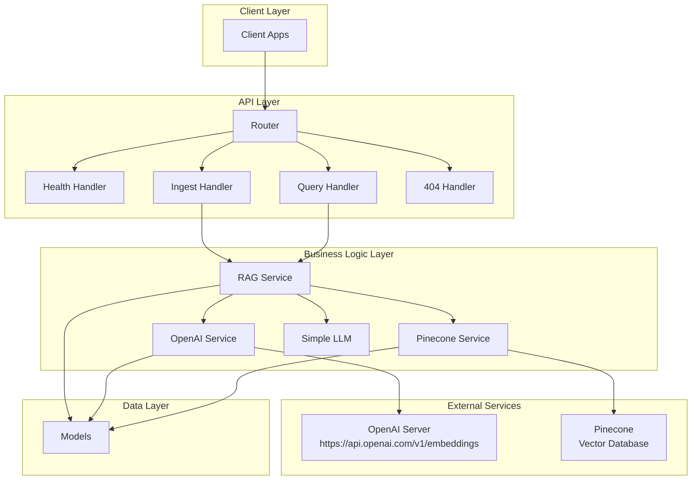

# Simple RAG System

A production-ready Retrieval-Augmented Generation (RAG) system built in Go that allows you to store documents and ask questions based on their content.

## ::::::::: Architecture Overview ::::::::::



## ::::::::: Data Ingestion Flow :::::::::

1. Client POST /ingest with documents
2. IngestHandler validates JSON
3. RAGService processes each document:
   └── OpenAIService converts text → vector
   └── PineconeService stores vector + metadata
4. Returns success response

## **::::::::: Query Flow :::::::::**

1. Client POST /query with question
2. QueryHandler validates JSON
3. RAGService executes RAG pipeline:
   └── OpenAIService: question → vector
   └── PineconeService: vector → similar documents
   └── SimpleLLM: documents → answer
4. Returns answer with sources

## **::::::::: Set Env Variables :::::::::**

```bash
export PINECONE_API_KEY="your_pinecone_api_key"
export PINECONE_INDEX_HOST="your_index_host"
export PINECONE_INDEX_NAME="your_index_name"

# OpenAI embedding
export OPENAI_API_KEY="your_openai_api_key"
```

## **::::::::: Run App :::::::::**

```bash
go run main.go
```

## **::::::::: Ingest Document  :::::::::::**

```bash
curl -X POST http://localhost:8080/ingest \
  -H "Content-Type: application/json" \
  -d '{
    "documents": [
      {
        "id": "rag-technique-1",
        "content": "Retrieval-Augmented Generation (RAG) is an AI framework that improves the quality of large language model (LLM) responses by grounding the model on external sources of knowledge. This reduces hallucinations and keeps the model updated with current information without requiring retraining."
      }
    ]
  }'
```

## **::::::::: Ask Question  :::::::::::**

```bash
curl -X POST http://localhost:8080/query \
  -H "Content-Type: application/json" \
  -d '{
    "question": "What is Go programming?",
    "top_k": 3
  }'
```

## **::::::::: Health Check :::::::::::**

```bash
curl http://localhost:8080/health
```
